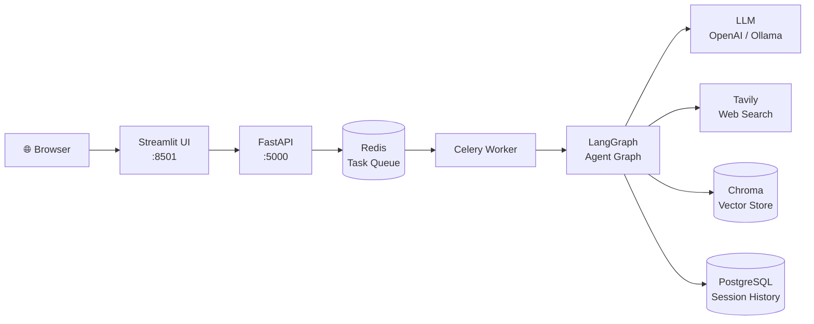
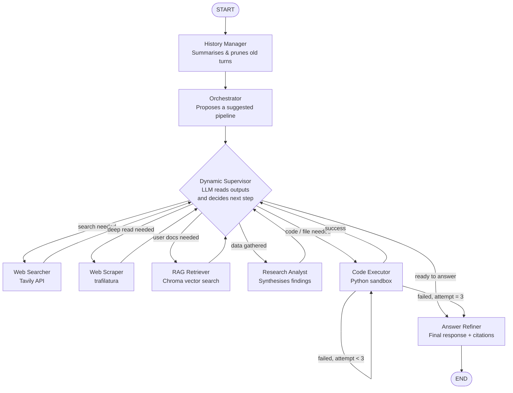

```
              ███╗   ███╗██╗   ██╗██╗  ████████╗██╗     █████╗  ██████╗ ███████╗███╗   ██╗████████╗
              ████╗ ████║██║   ██║██║  ╚══██╔══╝██║    ██╔══██╗██╔════╝ ██╔════╝████╗  ██║╚══██╔══╝
              ██╔████╔██║██║   ██║██║     ██║   ██║    ███████║██║  ███╗█████╗  ██╔██╗ ██║   ██║
              ██║╚██╔╝██║██║   ██║██║     ██║   ██║    ██╔══██║██║   ██║██╔══╝  ██║╚██╗██║   ██║
              ██║ ╚═╝ ██║╚██████╔╝███████╗██║   ██║    ██║  ██║╚██████╔╝███████╗██║ ╚████║   ██║
              ╚═╝     ╚═╝ ╚═════╝ ╚══════╝╚═╝   ╚═╝    ╚═╝  ╚═╝ ╚═════╝ ╚══════╝╚═╝  ╚═══╝   ╚═╝
                       ██████╗██╗  ██╗ █████╗ ████████╗██████╗  ██████╗ ████████╗
                      ██╔════╝██║  ██║██╔══██╗╚══██╔══╝██╔══██╗██╔═══██╗╚══██╔══╝
                      ██║     ███████║███████║   ██║   ██████╔╝██║   ██║   ██║
                      ██║     ██╔══██║██╔══██║   ██║   ██╔══██╗██║   ██║   ██║
                      ╚██████╗██║  ██║██║  ██║   ██║   ██████╔╝╚██████╔╝   ██║
                       ╚═════╝╚═╝  ╚═╝╚═╝  ╚═╝   ╚═╝   ╚═════╝  ╚═════╝    ╚═╝
                                ~  powered by LangChain + LangGraph  ~
```

# Multi-Agent Chatbot

A general-purpose AI chatbot powered by a team of specialized agents that collaborate to answer questions. It can search the web, read pages, run code, and chat over your own documents — all with cited sources.


---

## Capabilities

- **Web search** — searches the web via Tavily and answers current-events questions the model's training data can't handle
- **Deep page reading** — fetches and reads full pages (documentation, GitHub profiles, papers, articles) to extract specific information
- **Cited answers** — every response includes inline source links; citations only come from pages the agents actually visited
- **Document Q&A** — upload PDF, TXT, or Markdown files; the app chunks and indexes them so you can ask questions about your own content
- **Code generation & execution** — writes and runs Python in a sandboxed environment, returning output and any generated files (charts, CSVs, etc.) directly in chat
- **Multi-turn memory** — the full conversation history is replayed on every turn, so follow-up questions work naturally

---

## Tech stack

| Layer | Technology |
|---|---|
| **UI** | Streamlit |
| **API** | FastAPI |
| **Task queue** | Celery + Redis |
| **Agent orchestration** | LangGraph (StateGraph) |
| **LLM integration** | LangChain (`ChatOpenAI` / `ChatOllama`) |
| **Web search** | Tavily API |
| **Web scraping** | trafilatura |
| **Document storage** | Chroma (vector store, per session) |
| **Embeddings** | OpenAI or Ollama embeddings |

---

## Architecture

### System overview

Questions flow through four services before reaching the user:



- The **UI** (Streamlit) handles chat display, file uploads, and session management.
- The **API** (FastAPI) receives questions and dispatches them as background tasks.
- The **worker** (Celery) picks up tasks from Redis and runs the agent graph.
- The **agent graph** (LangGraph) is where the actual reasoning happens.

### Agent graph

The **orchestrator** reads the question and proposes a pipeline. The **dynamic supervisor** then takes over — it reads each agent's actual output and decides what to run next, deviating from the plan when the evidence calls for it (e.g. skipping the scraper when search returned nothing, or jumping straight to the answer when results are already sufficient).



| Agent | Role |
|---|---|
| **Orchestrator** | Reads the question and proposes which agents to run and in what order |
| **Dynamic Supervisor** | LLM-driven router — reads actual agent outputs and decides the next step, can deviate from the plan |
| **Web Searcher** | Queries Tavily and returns the top results with titles, URLs, and snippets |
| **Web Scraper** | Fetches and extracts the full text from 1–3 URLs using trafilatura |
| **RAG Retriever** | Searches the user's uploaded documents via Chroma vector store |
| **Research Analyst** | Synthesizes search results, scraped content, and documents into structured notes |
| **Answer Refiner** | Writes the final response with inline citations from visited URLs |
| **Code Executor** | Generates and runs Python in a sandboxed subprocess; retries up to 3 times on failure |

---

## Running the app

### Docker (recommended)

```bash
cp .env.example .env
# Add TAVILY_API_KEY and your LLM settings to .env
docker compose up --build
```

Open **http://localhost:8501**.

### Command line

```bash
python -m venv venv && source venv/bin/activate
pip install -r requirements.txt
python chat_script.py
```

---

## Environment variables

```
TAVILY_API_KEY=tvly-...    # required for web search
OPENAI_API_KEY=sk-...      # required when using OpenAI (the default)
```

The app also supports local models via Ollama or any OpenAI-compatible server — configure in `src/agents/llm.py`.
