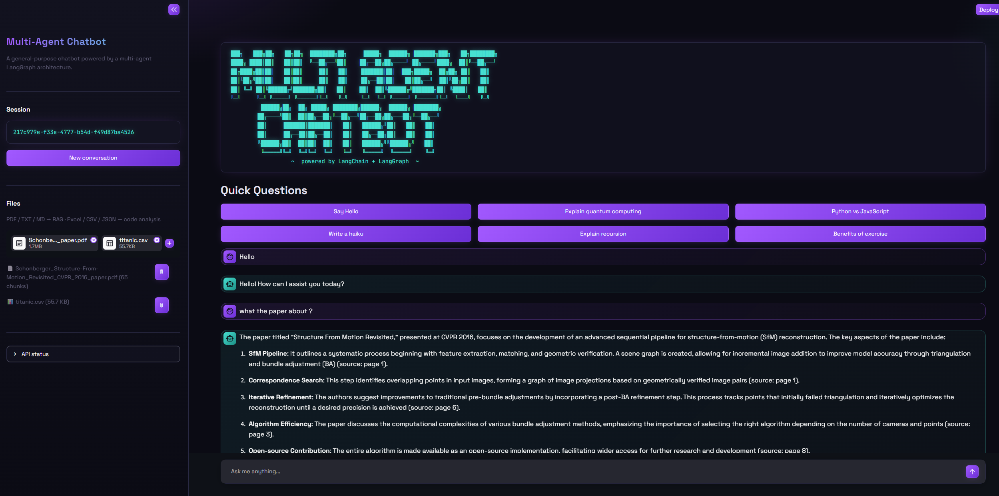

```
              ███╗   ███╗██╗   ██╗██╗  ████████╗██╗     █████╗  ██████╗ ███████╗███╗   ██╗████████╗
              ████╗ ████║██║   ██║██║  ╚══██╔══╝██║    ██╔══██╗██╔════╝ ██╔════╝████╗  ██║╚══██╔══╝
              ██╔████╔██║██║   ██║██║     ██║   ██║    ███████║██║  ███╗█████╗  ██╔██╗ ██║   ██║
              ██║╚██╔╝██║██║   ██║██║     ██║   ██║    ██╔══██║██║   ██║██╔══╝  ██║╚██╗██║   ██║
              ██║ ╚═╝ ██║╚██████╔╝███████╗██║   ██║    ██║  ██║╚██████╔╝███████╗██║ ╚████║   ██║
              ╚═╝     ╚═╝ ╚═════╝ ╚══════╝╚═╝   ╚═╝    ╚═╝  ╚═╝ ╚═════╝ ╚══════╝╚═╝  ╚═══╝   ╚═╝
                       ██████╗██╗  ██╗ █████╗ ████████╗██████╗  ██████╗ ████████╗
                      ██╔════╝██║  ██║██╔══██╗╚══██╔══╝██╔══██╗██╔═══██╗╚══██╔══╝
                      ██║     ███████║███████║   ██║   ██████╔╝██║   ██║   ██║
                      ██║     ██╔══██║██╔══██║   ██║   ██╔══██╗██║   ██║   ██║
                      ╚██████╗██║  ██║██║  ██║   ██║   ██████╔╝╚██████╔╝   ██║
                       ╚═════╝╚═╝  ╚═╝╚═╝  ╚═╝   ╚═╝   ╚═════╝  ╚═════╝    ╚═╝
                                ~  powered by LangChain + LangGraph  ~
```

# Multi-Agent Chatbot

A general-purpose chatbot built on **LangChain + LangGraph**, fronted by
**FastAPI**, **Celery**, and **Streamlit**. A supervisor-routed agent graph
searches the web (Tavily), scrapes specific pages (trafilatura), synthesizes
findings, and answers with cited sources. Runs fully **offline** against a
local **Ollama** or **vLLM** model, or against any OpenAI-compatible API.



---

## Capabilities

| Capability | Details |
|---|---|
| **Multi-agent reasoning** | A LangGraph supervisor dispatches specialist agents — Orchestrator, Web Searcher, Web Scraper, Research Analyst, Answer Refiner — and routes between them based on what the question needs. |
| **Web search** | Queries Tavily and returns the top-5 results (title, URL, snippet). Works for current-events questions the LLM's training data can't answer. |
| **Deep web scraping** | Uses trafilatura to fetch and strip-clean full page text from 1–3 URLs per turn — useful for reading GitHub profiles, papers, documentation, or any public page. |
| **Cited answers** | Every answer includes inline `[source](url)` links and a `**Sources:**` footer. Citations come only from URLs the agents actually visited — no hallucinated references. |
| **RAG over personal documents** | Upload PDF, TXT, or Markdown files in the sidebar. They are chunked, embedded, and stored in a per-session Chroma vector store. The agent retrieves relevant passages and cites the filename. |
| **Code execution** | A coding agent can write and run Python in a sandboxed subprocess, returning stdout and any generated files (images, CSVs, etc.) directly in the chat. |
| **Multi-turn memory** | Each browser session gets a unique `thread_id`. LangGraph's checkpointer replays the full conversation history on every turn, so follow-up questions work naturally. |
| **Async task queue** | Questions are dispatched to a Celery worker so the UI never blocks. Multiple users can send questions simultaneously; scale workers with `--scale worker=N`. |
| **Fully local / offline mode** | Point `LLM_BASE_URL` at a local Ollama or vLLM server and set no cloud API keys — zero data leaves your machine. |

---

## Why self-host?

Most hosted chatbots are black boxes: you send your data to someone else's
servers, pay per token, and accept their rate limits, content policies, and
model choices. Self-hosting flips every one of those tradeoffs:

**Privacy** — your prompts, documents, and conversation history never leave
your infrastructure. This matters for internal knowledge bases, proprietary
code, legal documents, or any sensitive data.

**Cost** — once you have a GPU (even a consumer RTX card), inference is
effectively free. No per-token charges, no subscription tiers. A 7B model
on an RTX 3090 answers questions faster than GPT-4 API latency for a fraction
of the long-term cost.

**No rate limits** — cloud APIs throttle requests per minute/day. A local
stack is limited only by your hardware. Batch workloads, automated pipelines,
and high-frequency use cases all become practical.

**Model choice** — you pick the model. Swap a quantized `llama3.1:8b` for
`qwen2.5:14b`, a fine-tuned code model, or a domain-specific model — all
without changing a line of application code, just the `LLM_MODEL` env var.

**Reproducibility** — pin a specific model version and your outputs are
stable. Cloud providers can change model behaviour under a stable name.

**Open weights = auditability** — with open-source models you can inspect
weights, training data cards, and alignment approaches. You are not trusting
a vendor's safety claims.

---

## Running the app

There are two ways to run it, depending on what you need:

| Option | Use when | Gets you |
|---|---|---|
| [A — Docker](#option-a--docker-recommended) | You just want it running, on Linux/macOS/Windows | The full stack: UI + API + worker + Redis |
| [B — CLI only](#option-b--cli-only-no-celery-no-ui) | You're debugging the LangGraph agent itself | Just the graph, no web layer |

Both options need at least one LLM backend configured. See
[LLM backends](#llm-backends) below. Web search additionally needs a
[Tavily](https://tavily.com/) API key (`TAVILY_API_KEY`).

### Option A — Docker (recommended)

Prerequisites: Docker Desktop, plus your chosen LLM backend running (see
[LLM backends](#llm-backends)).

```bash
# 1. Configure secrets
cp .env.example .env    # or create .env manually
# Edit .env — set TAVILY_API_KEY and your LLM backend vars

# 2. Build and launch everything (redis, api, worker, ui)
docker compose up --build

# 3. Open the UI
#    http://localhost:8501
```

That's it — Streamlit is now talking to FastAPI, which dispatches to the
Celery worker running the LangGraph agent. Watch
`docker compose logs -f worker` to see the agents route.

Useful commands:

```bash
docker compose logs -f worker                        # tail worker logs
docker compose up -d --scale worker=4                 # run 4 workers
docker compose exec redis redis-cli flushall           # clear conversation state
docker compose down                                    # stop, keep Redis data
docker compose down -v                                 # stop and wipe data
```

### Option B — CLI only (no Celery, no UI)

Useful for debugging the graph directly, without standing up Redis, FastAPI,
or Streamlit. Requires Python 3.12 and a configured LLM backend.

```bash
python -m venv venv
source venv/bin/activate        # Windows: venv\Scripts\activate
pip install -r requirements.txt

python chat_script.py                              # interactive mode
python chat_script.py "question 1" "question 2"    # batch mode
```

---

## Required environment variables

Set in `.env` (see [§4.4](#44-central-configuration-srcconfigpy) for the full list):

```
TAVILY_API_KEY=tvly-...      # required for web search
OPENAI_API_KEY=sk-...        # required when using ChatOpenAI (the current default)
```

---

## LLM backends

The application is backend-agnostic. Edit `src/agents/llm.py` to select one.
Embeddings follow the same toggle pattern in `src/rag/embeddings.py` — keep
it in sync with `llm.py` when switching providers.

### Ollama (local, recommended for getting started)

Ollama is the easiest way to run open-weight models locally. It manages model
downloads, quantisation, and GPU offloading automatically.

```bash
# Install: https://ollama.com
ollama pull llama3.1:8b       # fast, good general performance
ollama pull qwen2.5:7b        # better structured-output compliance for routing
ollama pull nomic-embed-text  # required for local embeddings
```

In `src/agents/llm.py`, uncomment:

```python
from langchain_ollama import ChatOllama
llm = ChatOllama(model="llama3.1:8b")
```

`OLLAMA_BASE_URL` defaults to `http://localhost:11434` on the host and
`http://host.docker.internal:11434` inside Docker — no extra config needed.

**Model recommendations:**

| Model | Size | Good for |
|---|---|---|
| `qwen2.5:7b` | ~5 GB | Best routing + structured output on small hardware |
| `llama3.1:8b` | ~5 GB | Strong general reasoning |
| `gemma3:12b` | ~8 GB | Good balance of speed and quality |
| `mistral:7b` | ~4 GB | Fast, good for simple Q&A |
| `deepseek-coder-v2:16b` | ~9 GB | Best for the coding agent |

### vLLM (local, high-throughput production serving)

[vLLM](https://github.com/vllm-project/vllm) exposes an OpenAI-compatible
API and is significantly faster than Ollama at high concurrency thanks to
PagedAttention. Use it when you need to serve multiple users or run batch
workloads.

```bash
pip install vllm
python -m vllm.entrypoints.openai.api_server \
    --model meta-llama/Meta-Llama-3.1-8B-Instruct \
    --port 8000
```

Then in `src/agents/llm.py`:

```python
from langchain_openai import ChatOpenAI
llm = ChatOpenAI(
    model="meta-llama/Meta-Llama-3.1-8B-Instruct",
    base_url="http://localhost:8000/v1",
    api_key="not-needed",         # vLLM does not require a real key
)
```

Set `LLM_BASE_URL=http://localhost:8000/v1` (or the Docker equivalent) and
the rest of the stack works unchanged.

### Any OpenAI-compatible endpoint

The pattern above works for any server that speaks the OpenAI chat-completion
API: [LM Studio](https://lmstudio.ai/), [llama.cpp server](https://github.com/ggerganov/llama.cpp),
[Jan](https://jan.ai/), [LocalAI](https://localai.io/), and others. Point
`base_url` at their endpoint and set a dummy `api_key`.

### OpenAI (cloud, current default)

```python
from langchain_openai import ChatOpenAI
llm = ChatOpenAI(model="gpt-4o-mini")   # requires OPENAI_API_KEY
```

`gpt-4o-mini` is the default because it gives reliable structured-output
compliance (critical for the supervisor) at low cost. Swap to `gpt-4o` for
higher-quality reasoning.

---

## Architecture

This section is the full architectural walkthrough: the multi-agent brain,
the service layer around it, and the Docker Compose orchestration that ties
everything together.

### 1. High-level topology

```
                     ┌──────────────────────────────────────────┐
                     │              host machine                │
                     │                                          │
                     │   Ollama / vLLM (native, GPU-accel.)    │
                     │     :11434 / :8000                       │
                     │         ▲                                │
                     │         │ http (langchain_ollama /       │
                     │         │       langchain_openai)        │
                     │         │                                │
                     │  ┌──────┴───── docker compose ────────┐  │
   browser ──────────┼─►│  ui (Streamlit)  :8501             │  │
                     │  │       │                            │  │
                     │  │       │ POST /question             │  │
                     │  │       │ GET  /answer/{id}          │  │
                     │  │       ▼                            │  │
                     │  │  api (FastAPI)   :5000             │  │
                     │  │       │                            │  │
                     │  │       │ apply_async                │  │
                     │  │       ▼                            │  │
                     │  │  redis (broker + result backend)   │  │
                     │  │       ▲                            │  │
                     │  │       │ consume tasks              │  │
                     │  │       │                            │  │
                     │  │  worker (Celery → LangGraph)       │  │
                     │  │       │                            │  │
                     │  │       ├── Tavily API (web search)  │  │
                     │  │       ├── trafilatura (scraping)   │──┼──► internet
                     │  │       └── LLM backend (inference) ─┼──┘
                     │  └────────────────────────────────────┘  │
                     └──────────────────────────────────────────┘
```

A user's question travels **ui → api → redis → worker → LangGraph → (LLM +
tools) → redis → api → ui**. The multi-agent graph lives inside the Celery
worker.

### 2. The LangGraph brain

The entire agent logic lives under `src/agents/`. The orchestration is a
`StateGraph` compiled with a memory checkpointer.

```
          +-------+
          | START |
          +---+---+
              |
              v
        +------------+
   +--->| Supervisor |---+
   |    +-----+------+   |
   |          |           |
   |    (routes to one)   |
   |    /   /  \   \  \   |
   |   v   v    v   v   v
   | +--+ +--+ +--+ +--+ +--+
   | |OR| |WS| |SC| |RA| |AR|
   | +-++ +-++ +-++ +-++ +-++
   |   |    |    |    |    |
   +---+----+----+----+----+
              |
              v
           +-----+
           | END |
           +-----+

OR = Orchestrator   WS = Web Searcher   SC = Web Scraper
RA = Research Analyst   AR = Answer Refiner
```

Every non-terminal node routes **back to the supervisor**. The supervisor is
the single routing authority; there are no direct node→node shortcuts. This
makes the flow inspectable and lets the supervisor handle arbitrary plan
shapes (search-only, scrape-only, search+scrape, neither).

#### 2.1 Agents (nodes in the graph)

| Agent | File | Role |
|---|---|---|
| **Orchestrator** | `nodes/orchestrator.py::orchestrator_node` | Reads the user's question, writes a plan naming which downstream agents to run. Never answers the user directly. |
| **Web Searcher** | `nodes/web_searcher.py::web_searcher_node` | LLM formulates a Tavily query → 5 search results (title + url + snippet). Records URLs into `cited_urls`. |
| **Web Scraper** | `nodes/web_scraper.py::web_scraper_node` | LLM picks 1–3 URLs (from search results, the plan, or constructed via known patterns like `github.com/<user>?tab=repositories&sort=stargazers`). `trafilatura.fetch_url` + `trafilatura.extract` pull the main text (boilerplate-stripped). Truncates to 6000 chars/URL. Records successful URLs into `cited_urls`. |
| **Research Analyst** | `nodes/research_analyst.py::research_analyst_node` | Synthesizes search snippets + scraped text into structured notes keeping each fact next to its source URL. |
| **Answer Refiner** | `nodes/answer_refiner.py::answer_refiner_node` | Produces the final user-facing answer with inline `[source](url)` citations taken from `cited_urls`, plus a `**Sources:**` section. Sets `resolved=True`. |
| **Supervisor (Speaker Selector)** | `nodes/speaker_selector.py::speaker_selector_node` | Router. Picks the next agent from the state. Uses `llm.with_structured_output(NextSpeaker)` so the LLM is forced to return one of the 6 valid literal names. Has a deterministic code-level fallback if the LLM mis-routes. |

#### 2.2 Shared state

The graph passes a single `GraphState` TypedDict through every node
(`src/agents/state.py`):

| Field | Type | Purpose |
|---|---|---|
| `messages` | `list` | Append-only conversation log (`HumanMessage`, `AIMessage`). |
| `next` | `str` | Next agent chosen by the supervisor. |
| `executed_agents` | `list[str]` | Ordered list of agents that have already run. Used by the supervisor's "no re-run" rules. |
| `resolved` | `bool` | `True` once `answer_refiner` finishes → triggers `END`. |
| `question` | `str` | The current turn's user question. |
| `plan` | `str` | Orchestrator's text plan. |
| `search_results` | `str` | Raw Tavily output (title/url/content). |
| `scraped_content` | `str` | trafilatura extractions, keyed by URL. |
| `cited_urls` | `list[str]` | Deduplicated URLs used across searcher + scraper; consumed by the refiner for citations. |

#### 2.3 Supervisor decision procedure

Rules applied in order (first match wins); agents already in
`executed_agents` are **banned** from selection:

1. `answer_refiner` is in `executed_agents` → **END**
2. `orchestrator` is **not** in `executed_agents` → **orchestrator**
3. Plan mentions *Web Searcher* and `web_searcher` not executed → **web_searcher**
4. Plan mentions *Web Scraper* and `web_scraper` not executed → **web_scraper**
5. (`web_searcher` or `web_scraper` in executed) and `research_analyst` not executed → **research_analyst**
6. Otherwise → **answer_refiner**

The LLM is constrained by `Literal` types in a Pydantic schema (`src/schemas.py`), so invalid
strings are impossible. If the LLM picks an already-executed agent (possible
with weak models), a deterministic fallback in `speaker_selector_node` runs
the same rules in Python.

#### 2.4 Why this design handles small local models

Small Ollama models (e.g. `gemma3:4b`, `llama3.1:8b`) tend to ignore prompt
constraints and produce free-form text. Two mitigations are baked in:

- **Structured output** (`with_structured_output`) on the supervisor and the
  scraper — the LLM literally cannot return anything other than the allowed
  shape.
- **Explicit banned-agent logic in the prompt** (the "GOLDEN RULE") reinforced
  by a Python-side safety net that overrides a bad pick.

For noticeably better compliance on routing and URL construction, switch to
`qwen2.5:7b` or `gpt-4o` in `src/agents/llm.py`.

#### 2.5 Citations

`cited_urls` is the single source of truth for citations. Both the searcher
and the scraper append URLs to it; the answer refiner is prompted to cite
**only** URLs present in that list, which prevents hallucinated sources.

### 3. Conversation flows

**Simple question (no web search)** — e.g. "What is recursion?"
```
Supervisor -> Orchestrator (plan: skip search, go to Answer Refiner)
Supervisor -> Answer Refiner (provides explanation)
Supervisor -> END
```
`executed_agents = [orchestrator, answer_refiner]`

**Question requiring web search** — e.g. "What is the latest news about OpenAI?"
```
Supervisor -> Orchestrator (plan: search, analyze, refine)
Supervisor -> Web Searcher (searches Tavily)
Supervisor -> Research Analyst (analyzes results into structured notes)
Supervisor -> Answer Refiner (crafts final response with citations)
Supervisor -> END
```
`executed_agents = [orchestrator, web_searcher, research_analyst, answer_refiner]`

**Question requiring deep page scraping** — e.g. "What is the most starred repo of GitHub user X?"
```
Supervisor -> Orchestrator (plan: scrape a constructed URL, analyze, refine)
Supervisor -> Web Scraper (LLM picks the URL; trafilatura extracts the content)
Supervisor -> Research Analyst (ranks/extracts from the scraped page)
Supervisor -> Answer Refiner (final answer with source citation)
Supervisor -> END
```
`executed_agents = [orchestrator, web_scraper, research_analyst, answer_refiner]`

**Search + scrape** — e.g. "Summarize the main findings of the latest CERN Higgs boson paper."
```
Supervisor -> Orchestrator (plan: search, then scrape the paper URL, analyze, refine)
Supervisor -> Web Searcher (finds candidate URLs via Tavily)
Supervisor -> Web Scraper (extracts the full text with trafilatura)
Supervisor -> Research Analyst (synthesizes snippets + full text)
Supervisor -> Answer Refiner (cites the paper URL)
Supervisor -> END
```
`executed_agents = [orchestrator, web_searcher, web_scraper, research_analyst, answer_refiner]`

**Greeting** — e.g. "Hello!"
```
Supervisor -> Orchestrator (plan: delegate to Answer Refiner)
Supervisor -> Answer Refiner (responds with greeting)
Supervisor -> END
```
`executed_agents = [orchestrator, answer_refiner]`

### 4. Service layer

#### 4.1 FastAPI (`src/api.py`)

Thin HTTP veneer on top of Celery.

| Endpoint | Purpose |
|---|---|
| `GET /health` | Liveness check. Used by Streamlit's sidebar and Docker's healthcheck. |
| `POST /question/` | Body: `{ "prompt": str, "thread_id": str? }`. Dispatches `process_chat_task` to Celery. Returns `{ "task_id": str }`. |
| `GET /answer/{task_id}` | Poll endpoint. Returns one of `Pending` / `Completed` / `Failed`. Handles all Celery states correctly. |

Everything is typed via Pydantic `ChatRequest` / `ChatResponse` /
`AnswerResponse` (`src/schemas.py`), with route handlers split out into
`src/routers/chat.py` and `src/routers/sources.py`.

#### 4.2 Celery worker (`src/tasks.py`)

Single task `process_chat_task(prompt, thread_id)` that wraps
`CIAgent.generate_reply`. `thread_id` is the LangGraph checkpointer key, so
each Streamlit session gets its own conversation memory — sessions do **not**
interfere with each other.

Why Celery and not just running the graph inline in FastAPI?

- **Long tasks off the request path**: an agent turn can take 5–60 seconds
  with a local LLM. Blocking an HTTP worker is unacceptable.
- **Concurrency**: scale workers independently (`docker compose up --scale
  worker=4`) without changing the API.
- **Retry + observability**: Celery gives us retries, state tracking, and a
  result backend for free.

#### 4.3 Streamlit (`app.py`)

- Renders the banner, chat history, and sidebar (session UUID, API health,
  new-chat button, document upload).
- Generates a `thread_id` per browser session (`uuid.uuid4()`).
- Calls `POST /question/`, then polls `GET /answer/{task_id}` every
  `RESPONSE_POLL_INTERVAL` seconds up to `RESPONSE_TIMEOUT_SECONDS`.

#### 4.4 Central configuration (`src/config.py`)

Every tunable reads from an environment variable with a sensible default:

| Variable | Default | Used by |
|---|---|---|
| `REDIS_URL` | `redis://localhost:6379` | Celery broker/backend |
| `CELERY_BROKER_URL` | `REDIS_URL` | Celery |
| `CELERY_RESULT_BACKEND` | `REDIS_URL` | Celery |
| `API_HOST` | `0.0.0.0` | FastAPI |
| `API_PORT` | `5000` | FastAPI |
| `API_BASE_URL` | `http://localhost:5000` | Streamlit client |
| `OLLAMA_BASE_URL` | `http://localhost:11434` | `ChatOllama` |
| `RESPONSE_TIMEOUT_SECONDS` | `180` | Streamlit polling |
| `RESPONSE_POLL_INTERVAL` | `0.5` | Streamlit polling |
| `OPENAI_API_KEY` | — | `ChatOpenAI` (currently the active LLM) |
| `TAVILY_API_KEY` | — | Tavily web search |

This is why the same code runs unchanged on the host, on WSL, or in Docker —
you just rewire the URLs via environment variables.

### 5. Docker orchestration

#### 5.1 Services

Defined in `docker-compose.yml`:

| Service | Image | Port | Role |
|---|---|---|---|
| `redis` | `redis:7-alpine` | 6379 | Broker + result backend |
| `api` | built from `Dockerfile` | 5000 | FastAPI |
| `worker` | same image as `api` | — | Celery worker running the LangGraph |
| `ui` | same image as `api` | 8501 | Streamlit |

`api`, `worker`, and `ui` share one image (`multiagent-chatbot:latest`) built
once from the repo's `Dockerfile`. This keeps the Docker cache hot and avoids
inconsistent dep versions between services.

#### 5.2 Networking

Docker Compose creates a default bridge network where services reach each
other by service name:

| From → To | URL |
|---|---|
| api/worker → redis | `redis://redis:6379` |
| ui → api | `http://api:5000` |
| api/worker → Ollama (on host) | `http://host.docker.internal:11434` |
| browser → ui | `http://localhost:8501` |
| browser → api (for curl/debug) | `http://localhost:5000` |

`host.docker.internal` exists automatically on Windows/macOS Docker Desktop.
On Linux we add `extra_hosts: ["host.docker.internal:host-gateway"]` so the
same URL works everywhere.

#### 5.3 Why Ollama stays on the host

Running Ollama inside a container on Windows requires the NVIDIA Container
Toolkit + WSL GPU passthrough configuration, which is brittle and you'd lose
the integration with Ollama's native update/model-management tooling. The
speedup from GPU-native Ollama is so large that it almost always dominates
any container-orchestration upside. vLLM users on Linux can run it in a
container with `--gpus all` if preferred.

#### 5.4 Health checks & startup order

- `redis`: `redis-cli ping` every 5s. Must be healthy before anything else starts.
- `api`: `curl /health` every 10s. `ui` waits for `api` to become healthy before launching.
- `worker`: depends on `redis` being healthy.

This eliminates the "Celery starts before Redis is ready" race you'd
otherwise hit.

#### 5.5 Data & state

- `redis-data` named volume persists keys across `docker compose down`
  restarts. `docker compose down -v` wipes it (useful when clearing stuck
  task state).
- LangGraph's `MemorySaver` checkpointer currently stores conversation
  memory **in the worker process's RAM**. Two implications:
  - A single worker is fine for one user.
  - Scaling to multiple workers requires swapping in a Redis-backed
    checkpointer (`langgraph.checkpoint.redis.RedisSaver`) so any worker can
    pick up any thread. Simple refactor when you need it.

#### 5.6 Dev vs. prod compose

- `docker-compose.yml`: production-ish. Image is self-contained; code is
  baked in at build time.
- `docker-compose.override.yml`: automatically merged on `docker compose up`.
  Bind-mounts `./` into `/app` and enables `uvicorn --reload`. You get hot
  reload on the API and the UI. For the worker, run `docker compose restart
  worker` after editing agent/graph code.
- To run the prod-like stack only: `docker compose -f docker-compose.yml up`.

#### 5.7 Common commands

```bash
# Build + bring up the stack (first run or after dep changes)
docker compose up --build

# Detached, tail logs
docker compose up -d
docker compose logs -f worker

# Scale workers for parallelism
docker compose up -d --scale worker=4

# Reset conversations (wipe Redis)
docker compose exec redis redis-cli flushall

# Shut down, keep Redis data
docker compose down

# Shut down AND wipe Redis volume
docker compose down -v

# Exec into a container for debugging
docker compose exec api bash
```

### 6. Request lifecycle (end-to-end)

A single user turn, traced through every component:

1. **Browser** — user types a question in Streamlit, hits enter.
2. **Streamlit (`ui`)** — appends to `display_history`, posts
   `{"prompt": "...", "thread_id": "<session-uuid>"}` to
   `http://api:5000/question/`.
3. **FastAPI (`api`)** — validates the prompt, calls
   `process_chat_task.apply_async(...)`. Celery serializes the payload and
   pushes it onto the Redis `celery` queue. Returns `{"task_id": "..."}`.
4. **Streamlit** — starts polling `GET /answer/{task_id}` every 0.5s.
5. **Celery worker** — picks up the task, calls
   `CIAgent.generate_reply(query, thread_id)`.
6. **LangGraph**:
   a. `START → orchestrator` — writes a plan.
   b. `supervisor` — reads plan + executed_agents, dispatches.
   c. `web_searcher` (if plan says so) — LLM → Tavily query → 5 results.
   d. `web_scraper` (if plan says so) — LLM picks URLs → trafilatura fetches
      and extracts the main text of each.
   e. `research_analyst` — synthesizes the collected raw material.
   f. `answer_refiner` — produces final answer with `[source](url)` citations
      from `cited_urls`; sets `resolved=True`.
   g. `supervisor` sees `resolved=True` → `END`.
7. **Celery worker** returns `{"answer": "...", "thread_id": "..."}`, which
   Celery stores in the Redis result backend under the task id.
8. **FastAPI `/answer/{task_id}`** — next poll sees `SUCCESS`, returns
   `{"status": "Completed", "result": {...}}`.
9. **Streamlit** — renders the answer into the chat, appends to
   `display_history`.

All LLM calls in step 6 go to the configured LLM backend — natively on the
host via `http://host.docker.internal:11434` for Ollama/vLLM, or to the
OpenAI API when `ChatOpenAI` is active.

---

## Roadmap

These are the most impactful improvements that would make this production-ready
for a team or a public deployment. None require architectural changes — they
are straightforward extensions of what is already here.

### Persistent session history

**Current state:** LangGraph uses `MemorySaver`, which stores conversation
state in the worker's RAM. Restarting the worker or scaling to multiple workers
loses all history.

**Fix:** Swap in `RedisSaver` from `langgraph-checkpoint-redis`. Each turn's
state is serialized to Redis under the `thread_id` key, so any worker can
pick up any thread and history survives restarts.

```python
# src/agents/graph.py
from langgraph.checkpoint.redis import RedisSaver
checkpointer = RedisSaver.from_conn_string(REDIS_URL)
```

This also enables **conversation export** (dump a thread's Redis keys) and
**conversation replay** (re-run a turn with different parameters).

### Multi-user support and authentication

**Current state:** the app is single-user by design — no login, no access
control. Anyone who can reach port 8501 can use it.

**What's needed for a team deployment:**

- **Authentication** — add an auth middleware to FastAPI (e.g. OAuth2 with
  JWT, or a simple API-key header). Streamlit can gate the UI with
  `st.login()` (available in Streamlit ≥ 1.37) or a reverse proxy like
  Nginx + basic auth.
- **Per-user namespacing** — replace the random `thread_id` with
  `{user_id}:{thread_id}` so users can't read each other's history. Chroma
  collections are already namespaced by `thread_id`; extend that to
  `{user_id}/{thread_id}`.
- **Session list** — store a `{user_id} → [thread_ids]` mapping in Redis or
  a lightweight SQL DB so users can resume past conversations from a sidebar
  dropdown.

### vLLM for production serving

**Current state:** Ollama is great for development but is single-threaded per
model: it queues requests rather than batching them. Under concurrent load
response times degrade linearly.

**vLLM** implements PagedAttention and continuous batching, achieving 10–20×
higher throughput on the same hardware for concurrent users. Switching is
one config change (see [LLM backends](#llm-backends) above). Recommended for
any deployment with more than 2–3 simultaneous users.

Additional vLLM capabilities worth enabling:

- **Speculative decoding** (`--speculative-model`) — 2–3× faster output on
  large models with a small draft model.
- **LoRA adapters** (`--lora-modules`) — serve domain-specific fine-tuned
  adapters alongside the base model without separate deployments.
- **Quantization** (`--quantization awq`) — run 70B models on 2×24 GB GPUs.

### Additional self-hosted model backends

| Backend | Best for |
|---|---|
| [llama.cpp server](https://github.com/ggerganov/llama.cpp) | CPU-only or mixed CPU+GPU inference; very low memory overhead |
| [LM Studio](https://lmstudio.ai/) | Local dev on Mac/Windows with a GUI model manager |
| [LocalAI](https://localai.io/) | Drop-in OpenAI replacement with Stable Diffusion, Whisper, and TTS built in |
| [Jan](https://jan.ai/) | Desktop app with an embedded OpenAI-compatible server |
| [Xinference](https://github.com/xorbitsai/inference) | Kubernetes-friendly multi-model serving with a model hub |

All expose an OpenAI-compatible `/v1/chat/completions` endpoint; switching
is a `base_url` change in `src/agents/llm.py`.

### Streaming responses

**Current state:** the UI polls for a completed answer and renders it all at
once. For long answers this means a blank screen for 10–30 seconds.

**Fix:** use LangGraph's streaming mode and Server-Sent Events (SSE) from
FastAPI. The Streamlit fragment that polls `/answer/{task_id}` becomes a
loop over an SSE stream, appending tokens as they arrive. The perceived
latency drops to the time-to-first-token (~1–2 s) instead of the full
generation time.

### Tool expansion

The supervisor graph is designed to be extended. High-value additions:

- **SQL / database agent** — give the agent read access to a PostgreSQL or
  SQLite database; useful for internal analytics questions.
- **Vector store search** — a dedicated RAG node that queries a persistent
  Chroma or Qdrant collection (separate from the per-session upload store)
  for a shared knowledge base across all users.
- **Calendar / email tools** — integrate with Google Calendar or Outlook via
  their APIs for scheduling and notification use cases.
- **Image generation** — route image-generation requests to a local Stable
  Diffusion server (e.g. via ComfyUI's API).

---

## Extension points

| Goal | How |
|---|---|
| Add another tool (e.g. SQL, a vector store) | Add a node file under `src/agents/nodes/`, export it from `nodes/__init__.py`, register it in `graph.py`, add a new `Literal` to `NextSpeaker` (`src/schemas.py`), update the `orchestrator` and `speaker_selector` prompts with the new agent's description and routing rules. |
| Swap LLM per-agent (e.g. GPT-4o for the supervisor, Llama for the rest) | `src/agents/agents.py` instantiates each chain independently; you can bind a different `llm` to each. |
| Persist conversations across worker restarts | Replace `MemorySaver` in `src/agents/graph.py` with `RedisSaver` from `langgraph-checkpoint-redis`. |
| Observability | Add `flower` to compose (`docker compose up -d flower`) for a Celery dashboard, or wire OpenTelemetry into FastAPI + LangChain. |
| Deploy to a cloud | The compose file runs on any Docker host. Move Ollama into a GPU-enabled container or switch the LLM to a cloud provider via `src/agents/llm.py`. |

---

## File map

```
.
├── Dockerfile                       # shared image for api/worker/ui
├── docker-compose.yml               # prod-ish stack
├── docker-compose.override.yml      # dev: bind-mount + --reload
├── .dockerignore
├── app.py                           # Streamlit UI entry
├── chat_script.py                   # CLI entry (bypasses Celery/FastAPI, uses graph directly)
├── requirements.txt
├── prompts/
│   └── agent_prompts.yaml           # all agent system prompts
├── src/
│   ├── api.py                       # FastAPI app: creates `app`, includes routers, /health
│   ├── schemas.py                   # every Pydantic model (agent structured-output + API DTOs)
│   ├── tasks.py                     # Celery app + chat/RAG tasks
│   ├── config.py                    # env-driven configuration
│   ├── banner.py                    # shared ASCII banner
│   ├── routers/
│   │   ├── chat.py                  # POST /question/, GET /answer/{task_id}
│   │   └── sources.py               # /sources/* RAG upload/list/delete routes
│   ├── rag/                         # personal source upload/retrieval (Chroma-backed)
│   │   ├── embeddings.py            # OllamaEmbeddings / OpenAIEmbeddings selector
│   │   ├── ingest.py                # parsing + chunking for uploaded PDF/TXT/MD
│   │   └── vectorstore.py           # per-thread Chroma collections
│   └── agents/
│       ├── llm.py                   # ChatOllama / ChatOpenAI / vLLM selector
│       ├── state.py                 # GraphState TypedDict
│       ├── agents.py                # LangChain runnables per agent
│       ├── nodes/                   # one graph node per file (including tool calls)
│       ├── graph.py                 # StateGraph wiring
│       ├── ci_agent.py              # thin wrapper around the compiled graph
│       └── utils.py                 # format_history, SSL patch, pipeline helpers
└── ui/
    ├── style.css
    └── display_utils/
        ├── utils.py                 # UI display helpers
        └── sources.py               # sidebar: upload/list/delete personal sources
```
